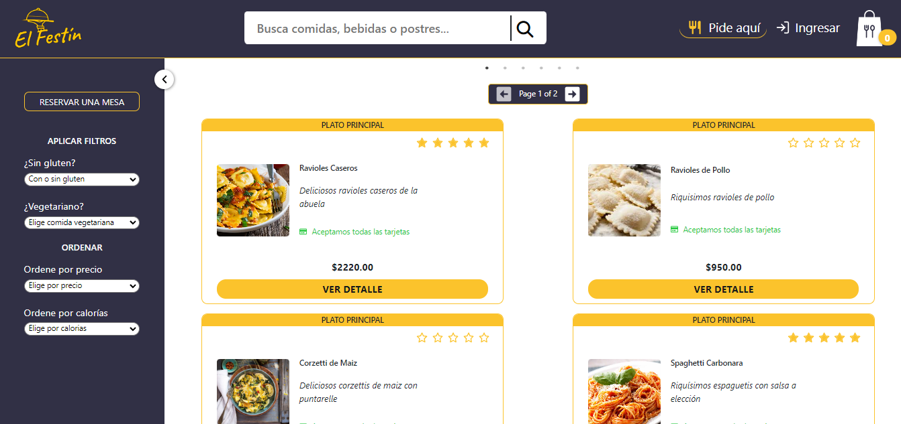
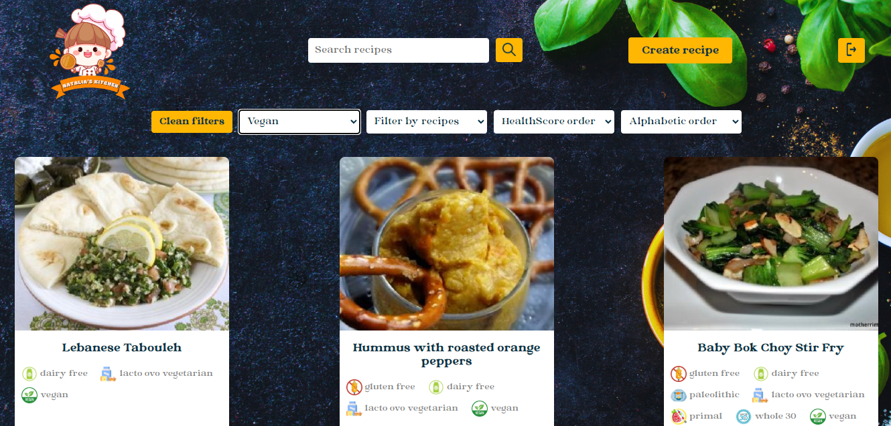
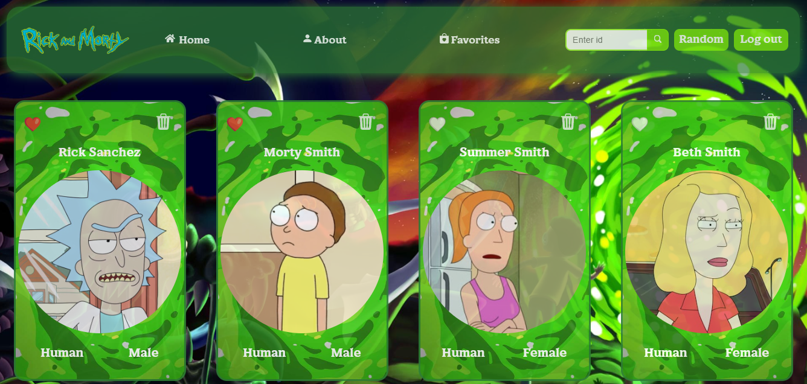

## 💫 About Me:
Hi! 👋 I am a Full Stack Developer graduated from Henry, the leading programming academy in Latin America. My background as an International Business Administration graduate from the University of La Sabana uniquely blends with my passion for front-end development. ✨ 

💻 My expertise encompasses the creation of fully functional and appealing web pages using technologies like HTML, JavaScript, CSS, React, Redux, Node.js, Express, and PostgreSQL. 

🌐 In addition to my technical skills, I stand out with my advanced level of English and intermediate proficiency in Portuguese, enabling me to communicate fluently with clients and collaborators worldwide. 

🙋‍♀️ The constant pursuit of learning is something that defines me. Furthermore, my level of commitment is a trait I not only carry with me but also infuse into every project I undertake. 

🚀 If you're seeking a professional who seamlessly blends technical skills with passion and curiosity, feel free to reach out to me! You can connect with me via email at **nataliasofiaroni@gmail.com** and explore my projects in my portfolio: **nataliaroni.netlify.app** 😊

## 💻 Tech Stack:
### 🎨 Front-End

### 🧠 Back-End

### 📊 Database

## 📌 Projects:
**🌟 El Festin Online (Final Project Henry)**  
   
**🌟 Recipes App (Individual Project Henry)**  
  
**🌟 Rick and Morty App (Integrative Project Henry)**  

## 🌐 Contact me:
  
  
📧 **Email:** nataliasofiaroni@gmail.com    📂 **Portfolio:** https://nataliaroni.netlify.app/ 

    
